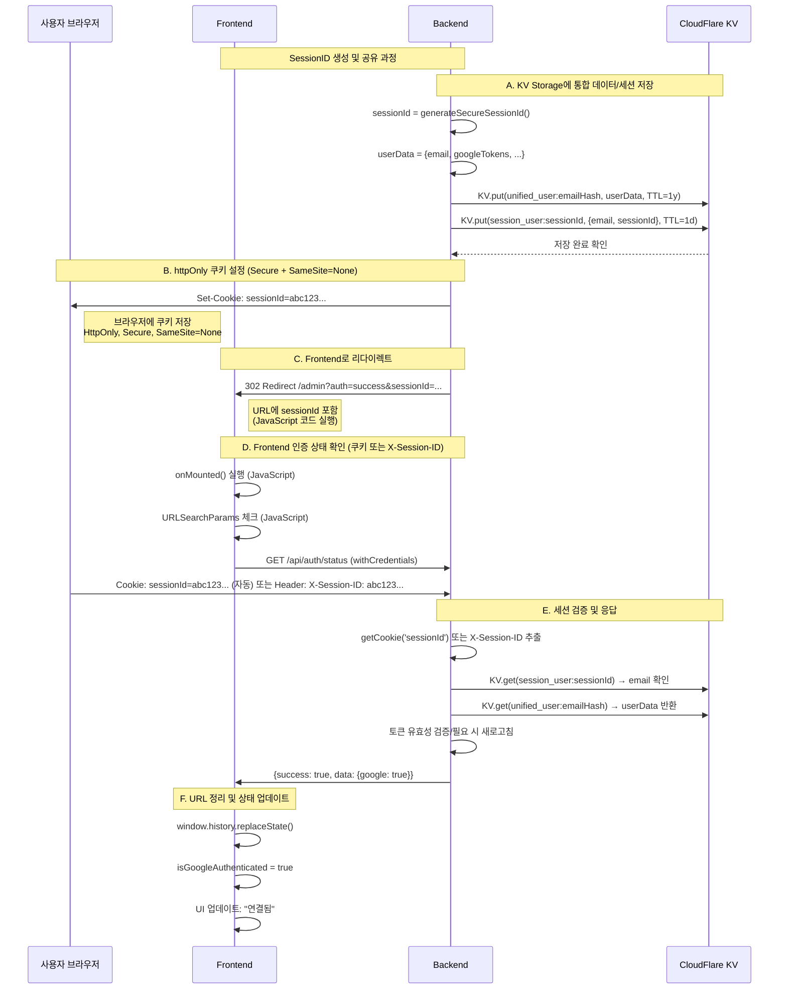
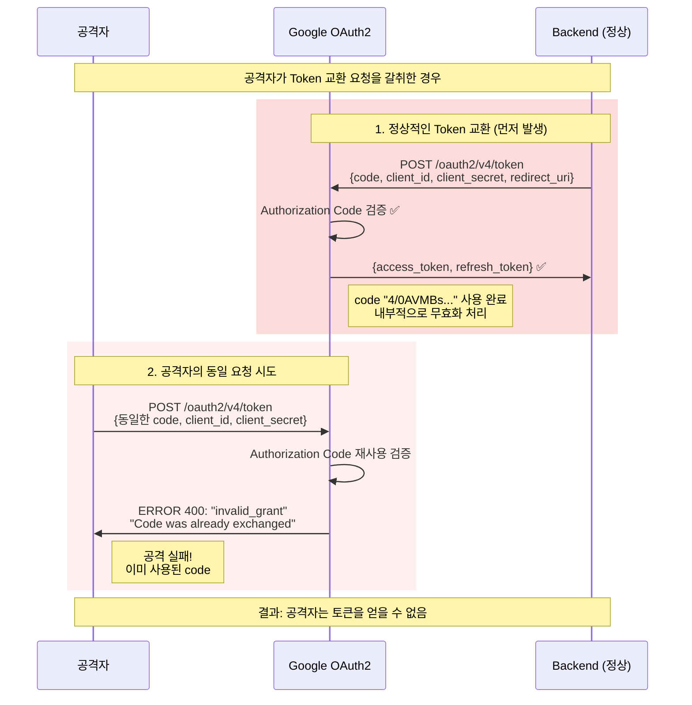

# Google OAuth2 인증 플로우 상세 가이드

## 개요
배송 관리 시스템에서 사용하는 Google OAuth2 인증 플로우의 상세한 과정과 보안 메커니즘을 설명합니다.

## OAuth2 인증 시퀀스 다이어그램

```mermaid
sequenceDiagram
    participant U as 사용자 브라우저
    participant F as Frontend<br/>(deliver-mgmt.pages.dev)
    participant B as Backend<br/>(workers.dev)
    participant G as Google OAuth2<br/>(accounts.google.com)
    participant KV as CloudFlare KV<br/>(세션 저장소)
    participant GS as Google Sheets API

    Note over U,GS: 1. 인증 시작 단계
    U->>F: "구글 스프레드시트 연결하기" 클릭
    F->>F: connectGoogleSheets() 실행
    F->>B: window.location.href = "/api/auth/google"
    
    Note over B,G: 2. OAuth2 인증 URL 생성
    B->>B: GoogleAuthService.getAuthUrl() 호출
    B->>B: 환경변수 검증 (CLIENT_ID, SECRET, REDIRECT_URL)
    B->>G: 구글 OAuth2 인증 페이지로 리다이렉트
    Note right of G: scope: spreadsheets, drive.readonly, userinfo.email<br/>access_type: offline, prompt: consent<br/>state: CSRF 방어용 랜덤 토큰(5분 TTL 검증)
    
    Note over U,G: 3. 사용자 인증 (구글 사이트)
    G->>U: 로그인 페이지 표시
    U->>G: 이메일/비밀번호 입력
    G->>U: 2단계 인증 (필요시)
    U->>G: 2단계 인증 완료
    G->>U: 앱 권한 동의 페이지 표시
    U->>G: "허용" 클릭
    
    Note over G,B: 4. Authorization Code 전송
    G->>B: GET /api/auth/google/callback?code=AUTH_CODE
    B->>B: code 파라미터 추출 및 검증
    
    Note over B,G: 5. Access Token 교환
    B->>G: POST /oauth2/v4/token<br/>{code, client_id, client_secret, redirect_uri}
    G->>G: Authorization Code 검증
    G->>G: Client Secret 검증
    G->>G: Redirect URI 검증
    G->>B: {access_token, refresh_token, expires_in}
    
    Note over B,KV: 6. 세션 생성 및 저장 (통합 저장 구조)
    B->>B: generateSecureSessionId() - 32바이트 랜덤
    B->>B: GoogleTokens 객체 생성
    Note right of B: {accessToken, refreshToken,<br/>connectedAt, expiryDate, email}
    B->>KV: KV.put(unified_user:emailHash, userData, {TTL: 1y})
    B->>KV: KV.put(session_user:sessionId, {email, sessionId}, {TTL: 1d})
    
    Note over B,F: 7. 보안 쿠키 설정 및 리다이렉트
    B->>B: setCookie(sessionId, httpOnly+secure+SameSite=None)
    B->>F: 302 Redirect → /admin?auth=success&sessionId=...
    
    Note over F,B: 8. 인증 상태 확인
    F->>F: onMounted() - URL 파라미터 확인
    F->>B: GET /api/auth/status (withCredentials: true)
    Note right of F: 쿠키 자동 전송:<br/>sessionId=abc123...
    
    Note over B,KV: 9. 세션 검증 및 토큰 새로고침
    B->>B: getCookie('sessionId') 추출 (또는 X-Session-ID/쿼리)
    B->>KV: KV.get(session_user:sessionId) → email 조회
    B->>KV: KV.get(unified_user:emailHash)
    KV->>B: userData.googleTokens 반환
    B->>B: shouldRefreshToken() 체크 (만료 5분 전 새로고침)
    
    alt 토큰 새로고침 필요
        B->>G: POST /oauth2/v4/token<br/>{refresh_token, grant_type: refresh_token}
        G->>B: {access_token, expires_in}
        B->>KV: KV.put(sessionId, updatedTokens)
    end
    
    Note over B,GS: 10. Google Sheets API 호출
    B->>GS: GET /v4/spreadsheets<br/>Authorization: Bearer access_token
    GS->>B: 스프레드시트 목록 반환
    
    Note over B,F: 11. 인증 완료 응답
    B->>F: {success: true, data: {google: true, spreadsheets: [...]}}
    F->>F: isGoogleAuthenticated = true
    F->>F: UI 업데이트 - "연결됨", "11개 스프레드시트"
    
    Note over F,F: 12. URL 정리 (보안)
    F->>F: window.history.replaceState() - OAuth 파라미터 제거
    
    Note over U,GS: 13. 배송 담당자 QR 인증 및 상태 변경 (관리자 세션 풀)
    F->>F: generateQR(staffName) 실행
    F->>B: POST /api/delivery/qr/generate-mobile/{staff}/{date}
    B->>KV: KV.get(admin_sessions_index:email) 또는 인덱스 조회
    B->>B: UnifiedUserService.getValidAdminSession()로 유효 토큰 획득
    B->>B: JWT 토큰 생성 {staffName, date, exp: 24h}
    B->>F: QR 이미지 + JWT URL 반환
    
    Note over U,U: 14. 모바일 QR 스캔 및 배송 페이지 접근
    U->>U: QR 코드 스캔 (모바일 카메라)
    U->>F: GET /delivery/{date}/{staff}?token=JWT_TOKEN
    F->>F: StaffMobileView.vue 로드
    
    Note over F,B: 15. JWT 기반 배송 데이터 조회
    F->>B: GET /api/sheets/date/{date}/staff/{staffName}
    Note right of F: Authorization: Bearer JWT_TOKEN
    B->>B: QR JWT 토큰 검증 (staff, date, expiry)
    B->>KV: KV.get(adminSessionId) - 풀링된 관리자 세션 사용
    B->>GS: GET /v4/spreadsheets/{id}/values<br/>Authorization: Bearer admin_access_token
    GS->>B: 해당 담당자 배송 데이터 반환
    B->>F: 필터링된 배송 주문 목록
    
    Note over F,B: 16. 배송 상태 업데이트 (담당자 액션, 직접 SMS 연동)
    U->>F: "배송 출발" 버튼 클릭 (모바일)
    F->>B: PUT /api/sheets/data/{date}/status
    Note right of F: Authorization: Bearer JWT_TOKEN<br/>{rowIndex, newStatus: "배송 출발"}
    B->>B: QR JWT 토큰 재검증
    B->>B: QR 토큰 → 관리자 세션 풀 토큰 사용
    B->>KV: (필요 시) UnifiedUserService로 유효 토큰 재확인
    B->>GS: PUT /v4/spreadsheets/{id}/values<br/>Authorization: Bearer admin_access_token
    Note right of GS: Google Sheets 실시간 업데이트
    GS->>B: 업데이트 완료 확인
    B->>F: {success: true, message: "상태 변경 완료"}
    
    Note over F,F: 17. 모바일 UI 상태 동기화
    F->>F: loadDeliveryData() 재호출
    F->>B: GET /api/sheets/date/{date}/staff/{staffName}
    B->>GS: 최신 데이터 조회
    GS->>B: 업데이트된 배송 데이터
    B->>F: 새로운 상태가 반영된 데이터
    F->>F: UI 업데이트: "배송 출발" → "배송 완료" 버튼 활성화
```



## 보안 메커니즘 상세 분석

### 1. Authorization Code 보안
- **일회성**: 한 번 사용 후 무효화
- **짧은 수명**: 약 10분 내외 만료
- **Client Secret 필요**: 토큰 교환 시 서버 측 비밀키 필수
- **Redirect URI 검증**: 등록된 콜백 URL로만 전송

### 2. 세션 관리 보안
```typescript
// 안전한 세션 ID 생성 (auth.ts:23-27)
function generateSecureSessionId(): string {
  const array = new Uint8Array(32);  // 32바이트 = 256비트
  crypto.getRandomValues(array);     // 암호학적 랜덤
  return Array.from(array, byte => byte.toString(16).padStart(2, '0')).join('');
}
```

세션 저장 구조(2025 업데이트)
```text
// 세션 메타데이터 (1일 TTL)
session_user:${sessionId} → { email, sessionId, createdAt }

// 통합 사용자 데이터 (1년 TTL, 단일 소스)
unified_user:${sha256(email+SALT)} → {
  email, emailHash,
  googleTokens: { accessToken, refreshToken, expiryDate, connectedAt, email },
  solapiTokens?,
  automationRules: [...],
  createdAt, updatedAt
}

// 관리자 세션 인덱스(24시간 TTL)
admin_sessions_index:${email} → { email, sessionId, createdAt }
```

### 3. 쿠키 보안 설정
```typescript
// auth.ts:99-105
setCookie(c, 'sessionId', sessionId, {
  httpOnly: true,    // XSS 공격 방지
  secure: true,      // HTTPS 필수
  maxAge: 86400,     // 24시간 만료
  sameSite: 'None',  // Cross-domain 허용
  path: '/'
});
```

### 4. 토큰 자동 새로고침
- **실제 만료시간 사용**: Google OAuth 응답의 `expiry_date` 사용(없으면 1시간 기본값)
- **5분 전 새로고침**: 토큰 만료 5분 전 자동 갱신
- **Refresh Token**: 서버에서만 관리, 브라우저 노출 없음
- **실패 시 재인증**: refresh 실패 시 자동으로 인증 해제

### 5. OAuth2 CSRF 방어(state)
- **생성**: 랜덤 32바이트 state 생성 후 `oauth_state:{state}`에 5분 TTL로 저장
- **검증**: 콜백에서 state 존재 여부 확인(없으면 400), 사용 후 즉시 삭제
- **효과**: CSRF 및 오리진 변조 방지

## SessionID 공유 플로우 상세 분석

### 7단계: 보안 쿠키 설정 및 리다이렉트 상세 플로우 (통합 저장 구조 반영)



### SessionID를 Frontend와 공유하는 방법

#### 방법 1: httpOnly Cookie (기본 방법) - **보안 강화**
```typescript
// Backend: auth.ts:99-105
setCookie(c, 'sessionId', sessionId, {
  httpOnly: true,    // JavaScript 접근 차단 (보안)
  secure: true,      // HTTPS 필수
  sameSite: 'None',  // Cross-domain 허용
  maxAge: 86400      // 24시간 만료
});

// Frontend: axios 자동 전송
axios.get('/api/auth/status', {
  withCredentials: true  // 쿠키 자동 포함
});
```

**보안 특징**:
- ✅ **XSS 방어**: `document.cookie`로 JavaScript 접근 불가
- ✅ **자동 전송**: `withCredentials: true`로 브라우저가 매 요청마다 자동으로 sessionId 전송
- ✅ **Frontend 격리**: Frontend 코드는 sessionId 값을 전혀 모름
- ⚠️ **물리적 노출**: 브라우저 쿠키 파일과 개발자 도구에서 확인 가능

**HTTP 요청 예시**:
```http
GET /api/auth/status HTTP/1.1
Cookie: sessionId=b08a7222097ff0cfba8a3772fbaddf1932f2178fe27012ef7b34c53a28a35873
```

#### 방법 2: X-Session-ID Header (Brave 대안)
```typescript
// Frontend: 콜백 리다이렉트 URL의 sessionId를 일시적으로 전달 (저장 금지)
const sessionId = new URLSearchParams(location.search).get('sessionId');
await axios.get('/api/auth/status', {
  headers: { 'X-Session-ID': sessionId ?? '' },
  withCredentials: true
});

// Backend: 다음 우선순위로 세션 확인
// 1) Cookie 'sessionId' → 2) Header 'X-Session-ID' → 3) Query 'sessionId'
```

**주의사항**:
- ⚠️ **임시 대응**: Brave/로컬에서 쿠키가 설정되지 않는 경우에 한함
- ⚠️ **보관 금지**: localStorage 보관 금지, URL 파라미터는 즉시 제거
- ⚠️ **노출면 증가**: httpOnly 쿠키 대비 공격면 증가 → 최소화

**HTTP 요청 예시**:
```http
GET /api/auth/status HTTP/1.1
X-Session-ID: b08a7222097ff0cfba8a3772fbaddf1932f2178fe27012ef7b34c53a28a35873
```

#### 방법 3: URL 파라미터 (임시 방법)
```typescript
// Backend: auth.ts:107-110
const redirectUrl = new URL('/admin', c.env.FRONTEND_URL);
redirectUrl.searchParams.set('sessionId', sessionId);

// Frontend: AdminView.vue:1107-1117
const urlParams = new URLSearchParams(window.location.search);
// URL에서 sessionId 추출하지만 localStorage 저장하지 않음
// URL 정리로 즉시 제거
```

### 보안 비교표

| 특징 | httpOnly Cookie | X-Session-ID Header | URL Parameter |
|------|----------------|---------------------|---------------|
| **XSS 방어** | ✅ JavaScript 접근 차단 | ❌ JavaScript 필요 | ❌ JavaScript 접근 |
| **자동 전송** | ✅ `withCredentials: true` | ❌ 수동 설정 필요 | ❌ 임시 방법 |
| **브라우저 호환** | ❌ Brave 차단 | ✅ 모든 브라우저 | ✅ 모든 브라우저 |
| **Frontend 격리** | ✅ 값 몰라도 됨 | ❌ 값 관리 필요 | ❌ URL에서 추출 |
| **물리적 보안** | ❌ 쿠키 파일 노출 | ❌ 코드/메모리 노출 | ❌ 브라우저 히스토리 |

**권장 방식**: **httpOnly Cookie**가 보안상 가장 안전하며, X-Session-ID 헤더는 **Brave/로컬 대응용**으로만 사용

### Backend에서 sessionId 확인 위치

**Backend 처리 순서** (실제 구현):
```typescript
// 1. 다중 소스에서 sessionId 추출 시도
const cookieSessionId = getCookie(c, 'sessionId');           // 쿠키에서
const headerSessionId = c.req.header('X-Session-ID');        // 헤더에서
const querySessionId = c.req.query('sessionId');             // URL 파라미터에서

// 2. 우선순위별 sessionId 선택
const sessionId = cookieSessionId || headerSessionId || querySessionId;

// 3. 통합 저장소에서 사용자 데이터 조회
const unifiedUserService = c.get('unifiedUserService');
const userData = await unifiedUserService.getSessionBasedUserData(sessionId);
// userData?.googleTokens 로 인증 판단 및 필요 시 토큰 자동 갱신
```

**브라우저 쿠키 확인 위치**:
- **Chrome**: F12 → Application → Cookies → `deliver-mgmt-backend.coreanq.workers.dev`
- **쿠키 정보**: sessionId 값, HttpOnly ✅, Secure ✅, SameSite=None
- **자동 전송**: `withCredentials: true` 설정 시 모든 API 요청에 자동 포함

## SessionID 보안 심층 분석

### httpOnly Cookie vs X-Session-ID Header 보안 비교

#### httpOnly Cookie 방식의 보안 메커니즘
```typescript
// Backend: httpOnly 쿠키로 브라우저에만 저장
setCookie(c, 'sessionId', sessionId, { httpOnly: true });

// Frontend: sessionId 값을 전혀 모름
const response = await axios.get('/api/auth/status', {
  withCredentials: true  // 브라우저가 자동으로 쿠키 첨부
});
```

**보안 계층**:
1. **네트워크 레벨**: HTTPS 암호화로 패킷 보호
2. **브라우저 레벨**: 쿠키 파일과 개발자 도구에서만 확인 가능
3. **JavaScript 레벨**: `document.cookie` 접근 완전 차단 (XSS 방어)

#### X-Session-ID Header 방식의 주의사항
```typescript
// Frontend: localStorage 보관 금지, URL 파라미터를 즉시 제거하고 1회성으로만 사용
const sessionId = new URLSearchParams(location.search).get('sessionId');
await axios.get('/api/auth/status', { headers: { 'X-Session-ID': sessionId ?? '' } });
```

**노출 지점**:
1. **네트워크 레벨**: HTTPS 암호화 (동일)
2. **브라우저 레벨**: localStorage, 소스코드에서 확인 가능
3. **JavaScript 레벨**: XSS 공격으로 sessionId 탈취 가능

### 실제 공격 시나리오별 분석

#### 1. 원격 XSS 공격
```javascript
// 악성 스크립트가 페이지에 삽입된 경우

// httpOnly Cookie 방식
try {
  document.cookie; // sessionId 보이지 않음 ✅
  localStorage.getItem('sessionId'); // null ✅
} catch (e) {
  console.log('XSS 공격 실패'); // sessionId 탈취 불가 ✅
}

// X-Session-ID Header 방식  
const sessionId = localStorage.getItem('sessionId'); // 금지: 저장 시 탈취 가능 ❌
const maliciousRequest = await fetch('/api/malicious', {
  headers: { 'X-Session-ID': sessionId }
}); // 저장 시 탈취 가능하므로 저장 금지 ❌
```

#### 2. 물리적 접근 공격
```bash
# httpOnly Cookie 방식
# 브라우저 쿠키 파일 직접 읽기
sqlite3 ~/.config/google-chrome/Default/Cookies \
  "SELECT value FROM cookies WHERE name='sessionId'"
# → sessionId 노출 가능 ⚠️

# X-Session-ID Header 방식
# localStorage 직접 읽기
sqlite3 ~/.config/google-chrome/Default/Local\ Storage/leveldb/*.ldb
# → sessionId 노출 가능 ⚠️
```

#### 3. 개발자 도구 접근
```javascript
// httpOnly Cookie 방식
document.cookie; // sessionId 보이지 않음 ✅
// 하지만 Application → Cookies에서는 확인 가능 ⚠️

// X-Session-ID Header 방식  
localStorage.getItem('sessionId'); // 저장하면 노출 ❌ (저장 금지)
```

### SessionID 핵심 보안 특징

1. **포인터 역할**: sessionId는 KV storage의 "키"일 뿐
2. **실제 토큰 분리**: Google tokens는 서버 KV에만 저장
3. **브라우저 격리**: httpOnly로 JavaScript sessionId 직접 접근 불가
4. **암호학적 강도**: 256비트 랜덤으로 추측 불가능

### 보안 권장사항

**최적 보안 설정**:
```typescript
// 1. httpOnly Cookie를 기본으로 사용
setCookie(c, 'sessionId', sessionId, {
  httpOnly: true,     // XSS 방어 최우선
  secure: true,       // HTTPS 필수
  sameSite: 'None',   // Cross-domain (Cloudflare 환경)
  maxAge: 86400       // 24시간 제한
});

// 2. X-Session-ID Header는 Brave/로컬 대응용만
// 3. localStorage 사용 금지 (보안 위험)
```

**결론**: httpOnly Cookie가 **원격 XSS 공격**에 대해 훨씬 안전하며, X-Session-ID 헤더는 브라우저/로컬 호환을 위한 대안으로만 사용해야 합니다.

### Cross-Domain 통신 보안

```typescript
// Frontend → Backend 요청 시
const response = await axios.get(`${API_BASE_URL}/api/auth/status`, {
  withCredentials: true  // 쿠키 자동 전송 활성화
});

// 브라우저가 자동으로 수행:
// Cookie: sessionId=a1b2c3d4e5f6...
```

**핵심**: Frontend는 **sessionId 값을 몰라도** 됩니다. 브라우저가 쿠키를 자동으로 전송하므로 Frontend JavaScript 코드에서는 sessionId를 직접 다루지 않습니다.

## 공격 시나리오별 방어

### Authorization Code 갈취 공격
**공격**: 네트워크 스니핑으로 code 탈취
**방어**: 
- Client Secret 없이는 토큰 교환 불가
- Redirect URI 불일치 시 구글이 거부
- 일회성 코드로 재사용 불가

### Token 교환 요청 갈취 공격 (상세 분석)
**공격 시나리오**: 
```http
POST /oauth2/v4/token HTTP/1.1
Host: oauth2.googleapis.com
Content-Type: application/x-www-form-urlencoded

code=4/0AVMBs...&
client_id=80696117268-...&
client_secret=GOCSPX-...&
redirect_uri=https://deliver-mgmt-backend.coreanq.workers.dev/api/auth/google/callback&
grant_type=authorization_code
```

**공격 실패 이유**:



**방어 메커니즘**:
1. **일회성 보장**: 구글이 code 재사용을 엄격히 차단
2. **시간 제한**: Authorization code는 ~10분 후 자동 만료
3. **순서 의존**: 정상 backend가 먼저 교환을 완료함

### Client Secret 노출의 실제 위험도
**더 심각한 위협**: Client Secret 자체가 탈취되는 경우
- 공격자가 **새로운 OAuth 플로우** 시작 가능
- 정상 사용자를 속여서 권한 탈취 가능
- **앱 전체의 보안 침해**

**현재 보호 수준**:
✅ CloudFlare Workers 환경변수로 격리  
✅ HTTPS 통신으로 전송 암호화  
✅ 서버 사이드에서만 사용  
✅ 로그에서 민감정보 제외

### Session Hijacking 공격
**공격**: sessionId 쿠키 탈취
**방어**:
- httpOnly로 JavaScript 접근 차단
- Secure로 HTTPS 필수
- 24시간 TTL로 피해 최소화

### CSRF 공격
**공격**: 다른 사이트에서 인증된 요청 위조
**방어**:
- SameSite 정책으로 차단 (일부 제한)
- withCredentials: true 필수
- Origin 검증

### XSS 공격
**공격**: 악성 스크립트로 토큰 탈취
**방어**:
- 토큰은 서버에서만 저장 (KV)
- httpOnly 쿠키로 JavaScript 접근 차단
- localStorage 사용 금지 정책

## 브라우저별 호환성

| 브라우저 | 쿠키 지원 | 호환성 |
|---------|----------|--------|
| **Chrome** | ✅ SameSite=None | 완전 호환 |
| **Firefox** | ✅ SameSite=None | 완전 호환 |
| **Safari** | ✅ SameSite=None | 완전 호환 |
| **Brave** | ❌ Cross-domain 차단 | **문제 발생** |

### Brave 브라우저 대응
Brave는 강화된 프라이버시로 cross-domain 쿠키를 차단합니다:

**해결 방법**:
1. **사용자 설정**: `brave://settings/cookies` → "모든 쿠키 허용"
2. **사이트 예외**: 특정 도메인 쿠키 허용 설정
3. **동일 도메인 배포**: 백엔드와 프론트엔드를 같은 도메인에 배포

## 환경별 구성

### Development (로컬)
- **Frontend**: `http://localhost:5173`
- **Backend**: `http://localhost:5001`
- **세션 저장**: In-memory Map (백엔드 `src/local.ts`)
- **쿠키**: `sameSite: 'None'; secure: true` (HTTP 환경에서는 브라우저가 쿠키를 저장하지 않을 수 있음)
- **대응**: 이 경우 콜백 리다이렉트의 `sessionId`를 헤더 `X-Session-ID`로 1회성 전달 후 URL 파라미터 즉시 제거

### Production (CloudFlare)
- **Frontend**: `https://deliver-mgmt.pages.dev`
- **Backend**: `https://deliver-mgmt-backend.coreanq.workers.dev`
- **세션 저장**: CloudFlare KV
- **쿠키**: `sameSite: 'None'; secure: true` (Cross-domain)

## 모범 사례

1. **환경변수 분리**: Client Secret은 서버 환경에서만 설정
2. **최소 권한**: 필요한 Google API scope만 요청
3. **자동 만료**: 세션과 토큰의 적절한 TTL 설정
4. **로그 보안**: 민감 정보 로깅 금지
5. **HTTPS 필수**: Production에서 모든 통신 암호화

이 OAuth2 구현은 **업계 표준 보안 모범 사례**를 준수합니다.
